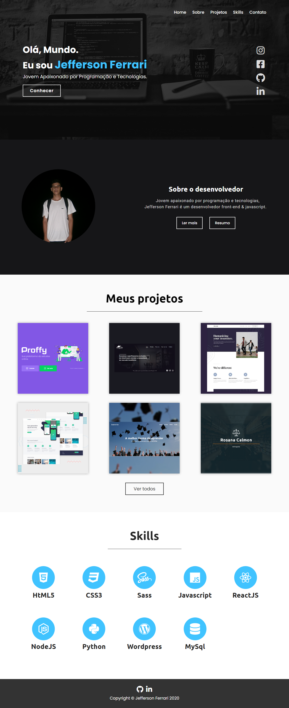

# Código fonte do meu repositório

Nesse repositório público eu guardo os códigos do meu site/portfólio.

Você pode acessa-lo clicando [aqui](https://jefferson-calmon.github.io/portfolio/)

## Linguagens e Tecnologias usadas

* JavaScript
* CSS
* HTML

Foto Exemplo
